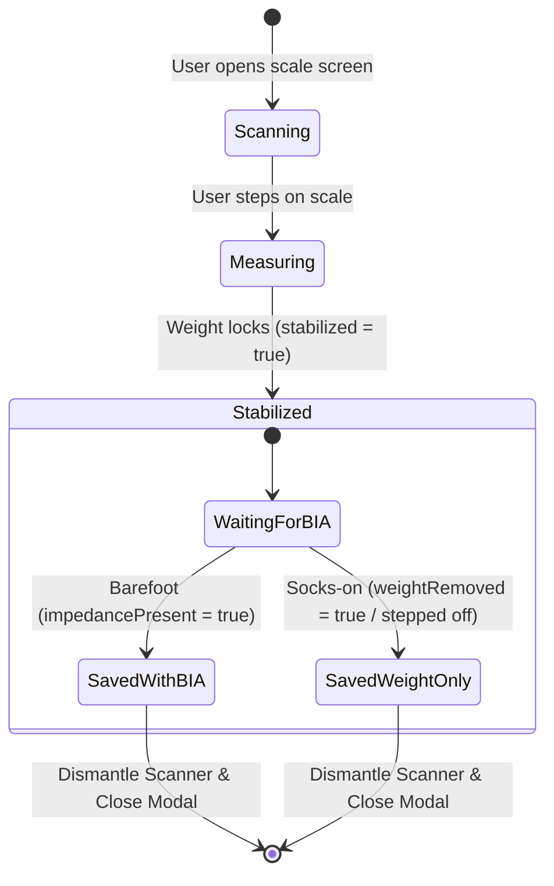

# BLE Scale Impedance Collection Improvement Plan

This plan details the technical analysis of your BLE scale research and outlines proposed improvements to the scale connection state machine in MorphIQ to create a fully hands-free weighing experience.

---

## Technical Analysis of BLE Scale Research

### 1. Verification of the Proposed Python Script
Your researched Python architecture correctly highlights the core aspects of the Xiaomi scale's BLE advertisement-based communication:
*   **Passive Scanning:** It uses passive LE interception (reading advertisements) rather than establishing a GATT connection.
*   **State Machine:** It tracks stabilization and impedance completion.
*   **Loop Termination:** It terminates scan operations immediately when the exit condition is met to conserve battery and CPU.

However, our research reveals **two critical errors** in that Python reference script that we must avoid:

1.  **Swapped Bytes:** The Python script assigns bytes `9-10` to `weight` and bytes `11-12` to `impedance`. In the actual Mi Body Composition Scale 2 protocol (and in our current codebase), **impedance is at bytes 9-10** and **weight is at bytes 11-12**. If we applied the Python snippet literally, the scale would read a `75kg` user as having a `2.5kg` weight and `15000` impedance.
2.  **Impedance Flag Misunderstanding:** The Python script uses `flags & (1 << 7)` (Bit 7 of Byte 0) to detect `has_impedance`. In the scale protocol, Bit 7 of Byte 0 is actually the **weight removed flag** (user stepped off the scale). If we checked this for impedance, the scale would never read body composition while the user stands on it; it would think impedance is ready only when they step off!
    *   *The correct Mi Scale 2 combined flags are:*
        *   `stabilized = (flags & 0x0400)` (Bit 2 of Byte 1)
        *   `impedancePresent = (flags & 0x4000)` (Bit 6 of Byte 1)

---

## Proposed Improvements

Our native `CapacitorBleAdapter.ts` **already utilizes this exact Passive BLE Interception architecture** (continuous background scanning via `BleClient.requestLEScan` with `allowDuplicates: true` and no GATT connection).

To further optimize the connection lifecycle and make it fully hands-free, we propose adding support for the **Weight Removed flag** (`0x0080` in combined flags, representing Bit 7 of Byte 0):



### UX Impact:
1.  **Barefoot Weighing (With BIA):** User stands on the scale. Weight stabilizes, the progress bar runs, BIA measurement completes (`impedancePresent` becomes true). The app immediately auto-saves the full composition metrics and closes the modal.
2.  **Socks-on Weighing (Weight Only):** User stands on the scale. Weight stabilizes. Since the user has socks on, the BIA scan fails. The user steps off the scale (`weightRemoved` becomes true). The app detects this transition, immediately auto-saves the weight (using fallback estimates), and closes the modal—**without requiring the user to tap any button or wait for a timeout!**

---

## Proposed Changes

### Domain & Interfaces

#### [MODIFY] [IBluetooth.ts](file:///C:/Users/march/source/repos/morphiq/src/core/interfaces/IBluetooth.ts)
- Add optional property `weightRemoved?: boolean;` to `IScaleData` interface.

---

### Data Adapters

#### [MODIFY] [WebBluetoothScale.ts](file:///C:/Users/march/source/repos/morphiq/src/data/bluetooth/WebBluetoothScale.ts)
- Update `parseScaleData` to extract the weight removed flag:
  ```typescript
  const weightRemoved = (flags & 0x0080) !== 0; // Bit 7 of Byte 0
  ```
- Return `weightRemoved` in the parsed object.

#### [MODIFY] [WebBluetoothScale.test.ts](file:///C:/Users/march/source/repos/morphiq/src/data/bluetooth/WebBluetoothScale.test.ts)
- Update unit tests to verify `weightRemoved` is parsed correctly.

---

### Presentation State

#### [MODIFY] [store.ts](file:///C:/Users/march/source/repos/morphiq/src/presentation/state/store.ts)
- Update the callback logic inside `startScaleScan`:
  ```typescript
  (data) => {
    set({
      scaleWeight: data.weight,
      scaleImpedance: data.impedance,
      scaleStabilized: data.stabilized,
      scaleImpedancePresent: data.impedancePresent,
    });

    if (data.stabilized && data.impedancePresent) {
      // Complete measurement with BIA
      get().addMeasurementFromScale();
    } else if (data.stabilized && data.weightRemoved) {
      // User stepped off after weight stabilized (BIA scan bypassed/failed)
      // Auto-save the weight-only measurement!
      get().saveWeightOnly();
    }
  }
  ```

---

## Verification Plan

### Automated Tests
- Update scale adapter unit tests in `src/data/bluetooth/WebBluetoothScale.test.ts`.
- Run vitest command to verify all tests pass:
  ```bash
  npx vitest run
  ```

### Manual Verification
1.  **Barefoot weighing:** Stand on the scale barefoot. Verify that once BIA completes, the scan auto-saves and closes.
2.  **Socks-on weighing:** Stand on the scale with socks on. Wait for the weight to lock (stabilize). Step off the scale. Verify that the modal closes and the weight is saved automatically.
